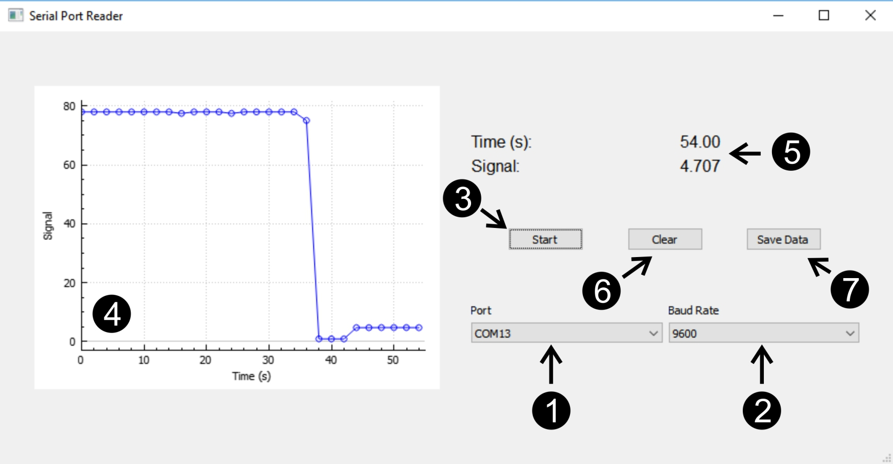

# SerialReader

Application for reading data from serial ports.

Developed with Qt and C++. Tested on Windows 10.

## Quick Start

Download (at least) and uncompress *SerialReaderWindows.rar*. There you can find an executable, *SerialReader.exe*. In the subfolder *installer* you can also find an installer.

Once you run the software, you will see the following GUI:

1. Select the port.
2. Select the baud rate.
3. Click the **Start** push button. The software will start now reading data from the serial port. Note that the label of the push button will now change to **Stop**. If you click it again, the software will stop reading from the serial port.
4. After you start reading the serial, data will be plotted in the GUI in real time.
5. Time and serial port data will also be updated in real time in the labels in the upper part of the GUI.
6. By clicking on the **Clear** push button, you will erase all registered data, as well as clean the plot.
7. Save the registered time vs. signal data  in a csv file by clicking on the **Save Data** push button.
